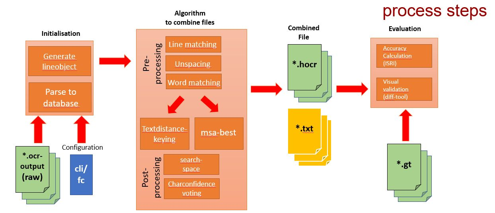

# 


[](https://hub.docker.com/r/ubma/ocromore/)

## Overview

**ocromore** is a command line driven post-processing tool for ocr-outputs.
The main purpose is to unite the best parts of multiple ocr-outputs to produce an optimal result.   
It can also be used to find optimal settings for ocr software, to visualize different 
information about the ocr results or context, or just query various things.
It is part of the [Aktienführer-Datenarchiv work process][akf-link],
but can also be used independently.

First, the program parses the different ocr-output files and saves the results to a sqlite-database.
The purpose of this database is to serve as an exchange and store platform using 
[pandas][pandas-link] as handler.
With an objectifier for the [dataframe][df-link]
from pandas a wide-range of performant use-cases is possible.
The software has in implementation of the Multiple sequence alignment (MSA) algorithm for combining multiple ocr-outputs.
To evaluate the results you can either use the commonly used
[ISRI tools][isri-link] to generate a accuracy report, or do visual comparison with diff-tools like [meld][meld-link].

### Beta Results

Our current character accuracy (ignoring whitespaces) results are:

| OCR-Engine |   AKF-II   |  UNLV   |
|:----------:|:----------:|:-------:|
| Abbyy      |  99,35 %   | 98,46 % |
| Ocropus (default en-model)    |     | 92,49 % | 
| Ocropus  (trained)   |  98,76 %   |  | 
| Tesseract  |  99,00 %   | 98,23 % |
| MSA        |  99,60 %   | 98,65 % |


You can find the AKF-II result in [docs/results][result-akf-link].
The results for UNLV are not optimized but still there is some improvement.
You can find the UNLV results in [Testfiles/results][result-unlv-link].

### Roadmap
✓  Parse files to the database  
✓  Preprocess file information    
✓  Combine file information  
✓  Evaluate results against groundtruth  
✓  Visual comparision (result vs. gt) with diff-tool  
✓  Store results in txt-file   
✘  Store results in database/hocr-files  
✘  Plot results in different ways (with matplotlib)

#### Supported fileformats
✓  hocr (with confidences)   
✓  abbyy-xml (with confidences "ASCII")
 
## Installation

This installation is tested with [Ubuntu][ubuntu-link] and we expect that it should
work for other similar environments similarly.

### 1. Requirements
- [Python 3.6+][python-link]
- [Meld][meld-link]
- [ISRI Analytic Tools for OCR Evaluation][isri-link]
- Recommended further:
  - [PyCharm][pycharm-link]
  - [hocr-tools][hocr-tools-link]

### 2. Copy this repository
```
git clone https://github.com/UB-Mannheim/ocromore.git
cd ocromore
```

### 3. Dependencies can be installed into a Python Virtual Environment:

    $ virtualenv ocromore_venv/
    $ source ocromore_venv/bin/activate
    $ pip install -r requirements.txt

## Docker (alternative way)

If you want to use the CLI commands under windows we recommend to use the docker:

```sh
git clone https://github.com/UB-Mannheim/ocromore.git
cd ocromore

# build it yourself
docker build -t ocromore .
docker run -it -v `PWD`:/home/developer/coding/ocromore ocromore

# or use the container from docker hub
docker pull ubma/ocromore
docker run -it -v `PWD`:/home/developer/coding/ocromore ocromore
```

You can than run the scripts for visual results outside docker in your OS.
For that you need Python and [Meld][meld-link] installed and add it to environment variables (ENV):
 - Variable = "Path"
 - Value = {directory to meld}\meld.exe

## Developing

The project was written in PyCharm 2017.3 (CE),   
so if you are a developer it's recommended to use it. 

Python 3.6.3 (default, Oct  6 2017, 08:44:35)   
GCC 5.4.0 20160609 on linux  
Tested on: Ubuntu17.10

Meld is the default diff-tool,  
but you can easily implemented the diff-tool of your choice. 

The ISRI Tools are necessary for the evaluation, but not for the combine process.

## Process steps



   1. Parsing all ocr-outputfiles to an database  
      (This step only has to be done once)
   2. Pre-process the gathered information  
      The results from the following processes can also 
      be stored directly to the database
        + Line-matching all files 
        + Unspacing words in each file  
          Unspacing means to delete whitespaces in spaced text  
          (E.g. H e l l o => Hello)
        + Word-matching all files per line   
   3. Combine file information
      + Different compare methods
        + Textdistance-Keying
             + Levenshtein
             + Damerau-Levenshtein
             + etc.
        + Multi-Sequence-Alignment (MSA)
            + pivot-based
            + linewise/wordwise
            + Adjustable search-space-processor correction
                + Matching similar character
                + Whitespace/Wildcard improvements
            + Adjustable decision parameter
                + Char confidence 
                + Best-of-n
   
   4. The output can be stored in the database and/or 
   as *.txt or *.hocr.
   
   5. Evaluate the output against groundtruth files or each other and generate a accuracy report.
   Or compare the files visual via diff-tools.


## Running

### Example
First of all you have to adjust the config-files.
There are two main config-files in "./configuartion/":
   + to_db_reader
        + path to ocr ocr-files (e.g. hocr)
        + parameter for parsing hocr to db
            + naming etc.
   + voter
        + path to db
        + parameter for combining the information from the ocr-files
        
The parameter to perform the examples are set as default.  
So you can just run the following commands.

At the current stage it is recommended to use PyCharm to perform the next steps.
        
Parse files to db and do pre-processing:

    # All parameters can set in the to_db_reader config
    # set HOCR2SQL parse files to db 
    # set POS parameter, to set the naming of db and tables 
    # set PREPROCSSING (It is recommended to perform the preprocessing steps directly after parsing  
    # but it is not necassary)
    
    $ python3 ./main_prepare_dataset.py
    
Combine files and generate a accuracy report:

    # All parameters can set in the voter config
    # set DO_MSA_BEST to perform msa (not Textdistance) method
    # set DO_ISRI_VAL to generate a accuracy report
    
    $ python3 ./main_msa_ndist_charconf.py
    
To perform a visual comparision:

    $ python3 ./result_visualization.py

The result are stored in ./Testfiles/tableparser_output/

Copyright and License
--------

Copyright (c) 2017 Universitätsbibliothek Mannheim

Author: 
 * [Jan Kamlah](https://github.com/jkamlah)
 * [Johannes Stegmüller](https://github.com/Hyper-Node) 

**ocromore** is Free Software. You may use it under the terms of the Apache 2.0 License.
See [LICENSE](./LICENSE) for details.


Acknowledgements
-------

The tools are depending on some third party libraries:
 * [hocr-parser][hocr-parser-link] parses hocr files into a dictionary structure.
    Originally written by [Athento][orig-hocr-parser-link].
 * [ISRI Analytics Tool][isri-link] for measuring the performance of and experimenting with OCR output.
 * [PySymSpell][pysymspell-link] a pure Python port of SymSpell. 
    It is an optional submodule for the project (MIT License).

[akf-link]:  https://github.com/UB-Mannheim/Aktienfuehrer-Datenarchiv-Tools "Aktienfuehrer-Datenarchiv-Tools"
[dataarchive-link]: https://digi.bib.uni-mannheim.de/aktienfuehrer/ "Aktienfuehrer-Datenarchiv"
[pandas-link]: https://pandas.pydata.org/ "Pandas"
[df-link]: https://pandas.pydata.org/pandas-docs/stable/generated/pandas.DataFrame.html "Dataframe"
[isri-link]: https://github.com/eddieantonio/isri-ocr-evaluation-tools "ISRI Analytics Tool"
[result-akf-link]: ./docs/results "akf results"
[result-unlv-link]: ./Testfiles/results "UNLV results"
[ubuntu-link]: https://www.ubuntu.com/ "Ubuntu"
[python-link]: https://www.anaconda.com/download/ "Anaconda"
[pycharm-link]: https://www.jetbrains.com/pycharm/ "PyCharm"
[meld-link]: http://meldmerge.org/ "meld"
[hocr-tools-link]: https://github.com/tmbdev/hocr-tools "hocr-tools"
[pysymspell-link]: https://github.com/ne3x7/pysymspell "PySymSpell"